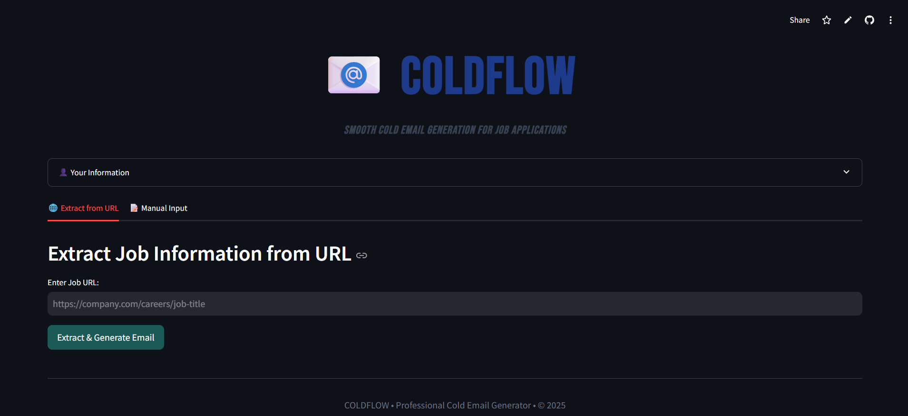
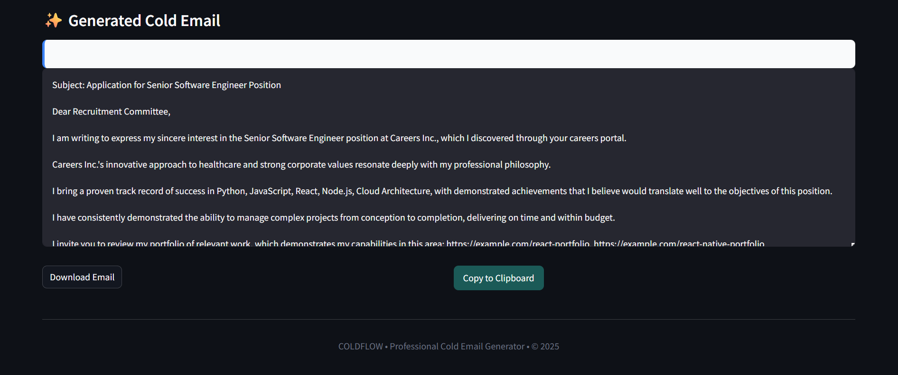

📧 COLDFLOW - Professional Cold Email Generator

🌟 Introduction ->

COLDFLOW is an intelligent cold email generation application designed to help professionals create compelling, personalized outreach emails for job applications. Unlike AI-dependent solutions, COLDFLOW uses sophisticated template-based generation and smart role detection to craft professional emails without requiring API keys or subscriptions.

In today's competitive job market, personalized outreach can make the difference between landing an interview and being overlooked. COLDFLOW streamlines this process by analyzing job descriptions and generating tailored emails that highlight your most relevant skills and experiences.

🎯 Key Features ->

| Feature | Description |
|---------|-------------|
| 🔐 No API Required** | Works completely offline without any external dependencies |
| 🎭 Smart Role Detection** | Automatically identifies technical, non-technical, and executive positions |
| 🌐 URL-based Extraction** | Extracts job information from career page URLs |
| 📝 Manual Input Option** | Flexible input methods for any job description |
| 🎨 Professional Templates** | Industry-appropriate email templates for different roles |
| 🔗 Portfolio Matching** | Intelligently suggests relevant portfolio items based on job requirements |
| 💼 Customizable User Profile** | Personalize emails with your professional information |
| 📤 Export Ready** | Easy download and copy functionality for generated emails |

Application interface screenshot

 🚀 How It Helps in Real Life

 For Job Seekers:
- Save Time: Generate professional emails in seconds instead of spending hours crafting each one
- Increase Response Rates: Professionally formatted emails that get noticed by recruiters
- Overcome Writer's Block: Perfect templates for those struggling with how to structure outreach emails
- Consistent Branding: Maintain professional tone and formatting across all applications

 For Professionals:
- Business Development: Excellent for consultants and freelancers seeking new clients
- Net Outreach: Scale your job application process without sacrificing quality
- Career Transitioning: Get help framing non-traditional experience for new industries
- Executive Search: Specialized templates for senior-level positions

 For Recruiters:
- Candidate Outreach: Template for reaching out to potential candidates
- Standardized Communication: Maintain professional standards in all correspondence

*Example of generated email output*

 🛠️ Installation & Usage

 Prerequisites
- Python 3.8 or higher
- pip (Python package manager)
  
----------------------------------------------------------------------------------------------------------------------------------------------------------------------------------------------------------------

HOW TO USE :

1)Set Up Your Profile

2)Fill in your personal and professional information in the "Your Information" section

3)Include your LinkedIn profile for additional credibility

4)Generate Emails
Option A: Paste a job URL and let COLDFLOW extract details automatically
Option B: Manually input job details for complete control

5)Review & Customize

6)Review the generated email

7)Make any personal tweaks if desired

8)Export

9)Download the email as a text file or copy directly to clipboards for immediate use

https://assets/steps.jpeg
Step-by-step usage guide
----------------------------------------------------------------------------------------------------------------------------------------------------------------------------------------------------------------

ARCHITECTURE ->

----------------------------------------------------------------------------------------------------------------------------------------------------------------------------------------------------------------

📁 Project Structure ->

coldflow/
├── app/
│   ├── main.py              # Main application file
│   ├── email_generator.py   # Email generation logic
│   ├── portfolio.py         # Portfolio management
│   ├── scraper.py           # URL content extraction
│   ├── utils.py             # Utility functions
│   └── resource/
│       └── my_portfolio.csv # Portfolio data
├── assets/  # Images for documentation
│   |--- architecture.jpeg
├   |--- interface.jpeg
│   |--- demo.jpeg
│   |--- steps.jpeg
│  
├── requirements.txt         # Python dependencies
└── README.md               # This file

----------------------------------------------------------------------------------------------------------------------------------------------------------------------------------------------------------------

🔧 Technical Details ->

Built With :

1)Streamlit - Web application framework

2)Pandas - Data manipulation and analysis

3)Scikit-learn - Machine learning for text similarity

4)BeautifulSoup - Web scraping capabilities

----------------------------------------------------------------------------------------------------------------------------------------------------------------------------------------------------------------

Algorithm Overview :

1)Text Analysis: Uses TF-IDF vectorization to match skills with portfolio items

2)Role Detection: Intelligent classification of technical vs. non-technical roles

3)Template Selection: Context-aware template matching based on job level and industry

4)Personalization: Dynamic insertion of user-specific information and relevant portfolio items

---------------------------------------------------------------------------------------------------------------------------------------------------------------------------------------------------------------

📄 License
This project is licensed under the MIT License - see the LICENSE.md file for details.

---------------------------------------------------------------------------------------------------------------------------------------------------------------------------------------------------------------

🙏 Acknowledgements ->

We would like to thank:

-> The Streamlit Team for creating an amazing framework for data applications

-> The Open Source Community for countless libraries and tools that make projects like this possible

-> Job Seekers Worldwide who provided feedback and inspiration for this tool

-> Career Coaches and HR Professionals who helped validate the approach and templates

